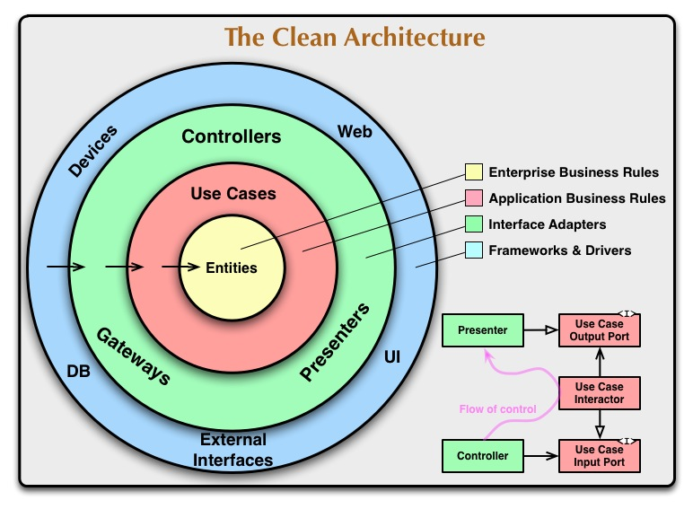
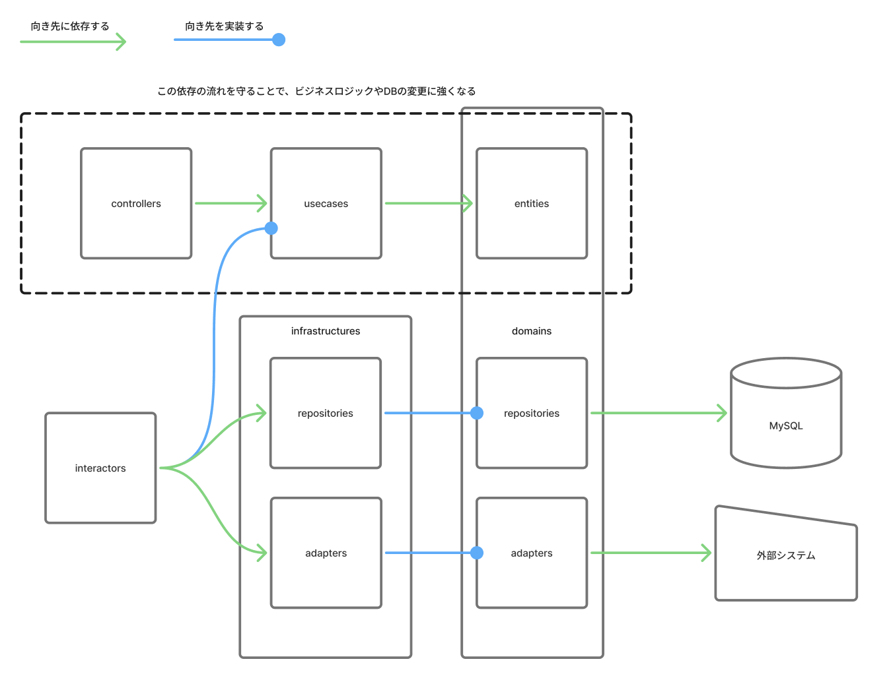

# サーバーサイド

## 概要
- クリーンアーキテクチャとなるような設計を意識して作成します。
- 依存関係が複雑にならないような構造を特に意識します。

参考:


## 設計

※頭に`I`がついているファイルはインターフェースのみを定義します。これは依存性逆転の原則を使ってディレクトリ間での依存関係を適切にするためです。


```
src
├──index.ts # エントリーポイント
├──contexts # 機能(機能名: Xxx)ごとにディレクトリを切る
│  ├──index.ts # DI(依存注入)を行う
│  ├──controllers
│  ├──├──XxxController.ts # パス・リクエスト・レスポンス定義
│  ├──usecases
│  ├──├──IXxxInteractor.ts # Interactorのインターフェース
│  ├──domains
│  ├──├──entities
│  ├──│  ├──Xxx.ts # ドメインエンティティの型定義
│  ├──├──adapters
│  ├──│  ├──IXxxAdapter.ts # Adapterのインターフェース
│  ├──├──repositories
│  ├──│  ├──IXxxRepository.ts # Repositoryのインターフェース
│  ├──infrastructures
│  ├──├──adapters
│  ├──│  ├──XxxAdapters.ts # DB以外の外部サービス連携の実装
│  ├──├──repositories
│  ├──│  ├──XxxRepository.ts # DB連携の実装
│  ├──interactors
│  ├──├──XxxInteractor.ts # ビジネスロジックの実装
```

## 各ディレクトリの説明
### controllers
- controllersはクライアントとのインターフェースを担う。
- controllersは基本的にusecaseにのみ依存する
- エンドポイントごとにControllerファイルを作成する。各Controllerファイルには、エンドポイントのパス、リクエスト・レスポンスパラメータ、レスポンスステータスを実装する。ビジネスロジックやDBの操作は実装しないこと。

### usecases
- ビジネスロジックのインターフェースを定義する。
- 各usecaseのファイルは単一の関数(execute)のみを持つ。
- usecasesはdomainにのみ依存する
- usecaseの切り方は非エンジニアに言葉で説明してわかるくらいの粒度で行う（eg. 商品を購入する→PurchaseItemInteractor、ユーザー登録する→RegisterUserInteractor など）
- ビジネスロジックの中身の実装はinteractorsで行う

### domains
- アプリケーションのコアとなる部分=よっぽどのことがない限り変わらない要件を定義する
- entityには扱うオブジェクトの型定義を実装する。必ずしもテーブル構造とエンティティの構造が一致している必要はない。

### infrastructures
- domains/repositoriesもしくはadaptersをimplementsし中身の実装を行う。
- DBのデータ操作はrepositoriesに実装する
- DB以外とのやり取りはadaptersに実装する（stripe連携やaws連携など）

### interactors
- usecasesをimplementsし中身の実装を行う
- domains/repositoriesもしくはadaptersに依存する
- ビジネスロジックを実装する

### index.ts
- DI(依存注入)を行う
- controllerをエクスポートする(src/index.tsでインポートしてexpressのルーティングに登録する)

## ルール
- 以下の依存関係を守ること


## なぜこの設計にしたか
- controller/usecase/domainに分けることで責務を細かく分離し、ファイルの肥大化を防ぐ
- contextsを分けることで各機能のモジュラー性を高めている
  - コードが複雑に絡み合うことを防ぐ
  - 各開発者の作業の独立性を高め作業の効率化を図る
- 変更が起きづらい部分に依存するように設計することで、変更に柔軟に対    応できるようにする
  - エンドポイントの定義が変わってもcontrollerだけを修正すれば良い
  - DBをMySQL以外に乗り換えたくなってもinfrastructure配下だけを修正すれば良い
- インターフェースを使ってDIするようにすることで、APIテスト内でのモックをしやすくする

# フロントエンド
wip